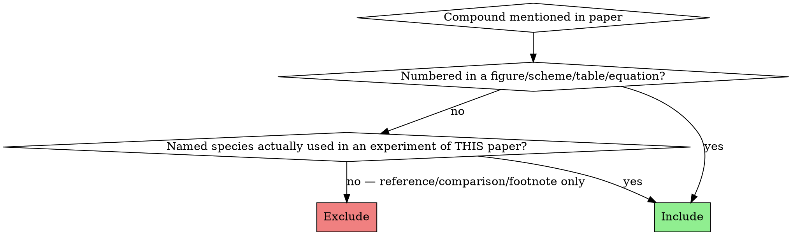

# paper-fetch-smiles

## Environment check (run BEFORE any code execution)

This skill runs code in the default mamba env **`skill-env`** (RDKit + PubChemPy + requests — all light). Run this check first; if it fails, STOP and report the missing piece — do NOT install ad-hoc (per global CLAUDE.md, always update `/storage/edm/envs/skill-env.yml` first).

```bash
ENV=skill-env
micromamba env list | awk '{print $1}' | grep -qx "$ENV" \
  || { echo "ERROR: mamba env '$ENV' not available — define /storage/edm/envs/${ENV}.yml and create with: micromamba create -n $ENV -f /storage/edm/envs/${ENV}.yml" >&2; exit 1; }
for pkg in rdkit pubchempy requests; do
  micromamba run -n "$ENV" python -c "import $pkg" 2>/dev/null \
    || { echo "ERROR: python package '$pkg' not available in env '$ENV' — add to /storage/edm/envs/${ENV}.yml and reinstall." >&2; exit 1; }
done
```

If existing examples below show `micromamba run -n mdclustering ...`, that's a legacy project-specific env from prior runs — substitute `$ENV` (`skill-env`) unless the user explicitly asks for the project env.

## Purpose

Turn a chemistry paper PDF into a resolved compound catalog. The skill produces three artifacts in tandem:

1. **`compounds.py`** — hand-authored from the paper. The **ground truth** (`PAPER_COMPOUND_TABLE` + `EXPECTED_ELECTRONIC_STRUCTURE`). Edit this if a compound needs correcting, then regenerate the other two.
2. **`compounds.json`** — `compounds.py` resolved against PubChem and (optionally) tmQMg-L by the **`chem-db-lookup`** skill (`build`). Carries the hand-authored fields, the PubChem-resolved fields, the run `metadata`, AND the `expected_electronic_structure` block (so downstream consumers need only this one file). This is what downstream notebooks load.
3. **`compounds.png`** — 2D-structure grid rendered by `scripts/cli.py render`. Mandatory visual-verification artifact.

`compounds.py` is the input to the resolver; `chem-db-lookup` populates `compounds.json` from PubChem + tmQMg-L and carries the electronic structure through; this skill's renderer turns the resolved data into a structure grid.

## When to use

- A user hands you a paper PDF and asks for SMILES of every compound.
- A downstream notebook expects `PAPER_COMPOUND_TABLE` + `EXPECTED_ELECTRONIC_STRUCTURE` from a paper.

## When NOT to use

- Just one or two SMILES from a figure → `authoring-smiles` directly.
- Editing an existing SMILES (NL instruction) → `fast-smiles`.

## Full conversion workflow (run end-to-end; don't stop at compounds.json)

This skill is the **entry point** for "convert this paper." A compound catalog is
the *first* deliverable, not the whole job: when the paper has figures/schemes or
a computational SI, those carry the highest-value, hardest-to-reconstruct data
(the DFT geometries exist nowhere but that SI). Drive the pipeline in order, each
step its own skill:

1. **`paper-figure-extract`** → figures / schemes / energy-diagram → `mechanism_from_diagram.json` — **REQUIRED SUB-SKILL when the paper has figures/schemes** (optional pre-step; informs which species exist).
2. **Author `compounds.py`** here (via `authoring-smiles`).
3. **`chem-db-lookup` `build`** → `compounds.json` (+ optional crystal data) — **REQUIRED SUB-SKILL for resolution** (PubChem/tmQMg-L/crystal). This skill no longer resolves itself.
4. **`paper-fetch-smiles` `render`** → `compounds.png` (the visual-verification ritual).
5. **`si-xyz-extract`** → `table.json` + `structures/*.xyz` — **REQUIRED SUB-SKILL when an SI PDF exists**.
6. **`reaction-mechanism-graph` `build-index`** → `index.json` + mass balance — **REQUIRED SUB-SKILL when a catalytic cycle is drawn**.

**Red flag:** about to report the conversion done after `compounds.json`/`compounds.png`
while an SI PDF or figures are still present. The conversion is NOT complete —
continue the workflow (steps 5–6 / step 1). Stopping early because the compound
catalog "feels done" is the most common failure here.

## Output files (HARD requirement)

A successful run produces **three artifacts** in the user-specified directory:

| File | Purpose | How it is produced |
|---|---|---|
| `compounds.py` | Hand-authored **ground truth** (`PAPER_COMPOUND_TABLE` + `EXPECTED_ELECTRONIC_STRUCTURE`). Human-readable, typed, version-controllable. | Written by this skill from the paper. |
| `compounds.json` | Resolved DB — PubChem-canonical SMILES / InChI / CID / MW, optional tmQMg-L crystal data, RDKit review block per row, run metadata, plus the carried-through `expected_electronic_structure`. | Produced by `chem-db-lookup` `build` from `compounds.py` (Workflow step 9). |
| `compounds.png` | RDKit 2D-structure grid for visual verification. | `scripts/cli.py render` (Workflow step 10). |

**All three must exist** when the skill reports done. The PNG is what reviewers check first; the JSON is what downstream notebooks load; the PY is the ground truth that the JSON and PNG are regenerated from.

### `compounds.py` shape

```python
# <relative_path>/compounds.py
"""Hard-coded chemistry data for the <FirstAuthor> <Year> <topic> paper."""
from __future__ import annotations
from typing import Any

PAPER_COMPOUND_TABLE: list[dict[str, Any]] = [
    {"paper_id": "<ID>", "role": "<role>",
     "name": "<descriptive name>",
     "fallback_smiles": "<RDKit-parseable SMILES>"},
    ...
]

EXPECTED_ELECTRONIC_STRUCTURE: dict[str, dict[str, Any]] = {
    "<species_key>": {"oxidation_state": <int>, "d_count": <int>,
                      "geometry_class": "<str>",
                      "spin_state": "<str>"},
    ...
}
```

Every row in `PAPER_COMPOUND_TABLE` has all four keys present. No optional fields, no `null`.
`EXPECTED_ELECTRONIC_STRUCTURE` is present even if empty (`{}` for purely organic papers).

### `compounds.json` shape

Emitted by the resolver CLI. Top-level keys are `metadata` (run statistics), `expected_electronic_structure` (carried through verbatim from `compounds.py`), and `compounds` (a list, one entry per `PAPER_COMPOUND_TABLE` row, enriched with PubChem fields `iupac`, `smiles`, `canonical_smiles`, `isomeric_smiles`, `inchi`, `inchikey`, `cid`, `mw`, plus `source`, optional `tmqml` block, and an RDKit `review` block). Inspect `test/ni-louie/compounds.json` for the canonical example (note: that fixture predates the EES carry-through and so has no `expected_electronic_structure` key).

Unresolved rows still appear in `compounds.json` with `source: "fallback"` and the hand-authored `fallback_smiles` carried through — never silently dropped.

## Figures, schemes, SI, and mechanism — separate skills

The figure/scheme image extraction, SI `.xyz`/energy-table extraction, and the
mechanism-graph + mass-balance join each live in their own skill now. This skill
orchestrates them (see [Full conversion workflow](#full-conversion-workflow-run-end-to-end-dont-stop-at-compoundsjson)):

- **`paper-figure-extract`** — `extract-figs` (Figure N energy diagrams) and `extract-schemes` (Scheme N reactions) → cropped PNGs + `figs.json`/`schemes.json` + analyzer-subagent contracts that write `mechanism_from_diagram.json`.
- **`si-xyz-extract`** — `extract-table` → `table.json`, `extract-xyz` → `structures/*.xyz` (the `charge=N multiplicity=M` line-2 HARD rule) + planner/reviewer subagent contracts.
- **`reaction-mechanism-graph`** — `build-index` → `index.json`, joining structures/energies/compounds with `mechanism.json` and per-step mass-balance verification.

All four share the append-only `paper_fetch_log.md` REVIEW/VERIFIED contract.

## Allowed `role` vocabulary

The `role` is not free-form text. Every compound in the paper plays exactly one part in the chemistry, and the field must come from the closed set below. The four **meta-categories** are the only options:

| Meta-category | Question to ask | Concrete `role` values |
|---|---|---|
| **Catalyst system** | "Is this what enables the reaction (added to the flask, but not consumed stoichiometrically)?" | `catalyst` (generic), `catalyst_precursor`, `ligand` |
| **Educt (substrate)** | "Is this what gets consumed and transformed?" | `educt` (generic), or a substrate noun the paper uses (`diyne`, `dienyne`, `enyne`, `alkene`, `alkyne`, `aldehyde`, `imine`, `arene`, `CO`, `CO2`, …) |
| **Product** | "Is this what the reaction makes?" | `product` (generic), or a product noun the paper uses (`pyrone`, `pyridone`, `arene`, `lactone`, `amine`, …) |
| **Mechanistic species** | "Is this drawn inside the catalytic cycle as a transient or resting state?" | `intermediate` (on-cycle), `off_cycle` (deactivation / resting state) |

The educt → product reasoning step (below) is what tells you which meta-category a compound belongs to. Once the meta-category is fixed, the concrete `role` value is one of:

| `role` | When |
|---|---|
| `catalyst` | Generic catalyst fallback — use for a pre-formed isolated catalyst complex that does not cleanly fit `catalyst_precursor` (which implies an in-flask precursor + ligand assembly) |
| `catalyst_precursor` | Metal complex actually added to the flask (Ni(COD)2, [Rh(cod)Cl]₂, …) |
| `ligand` | Added co-ligand (NHC, phosphine, bipyridine, …) — also use for the free ligand of a precursor when discussed separately (e.g., COD as a separate entry from Ni(COD)2) |
| `educt` | Generic substrate fallback — use when the paper does not name a specific class, or when several substrate classes share a row and one umbrella label is cleaner |
| `diyne`, `dienyne`, `enyne` | Substrate class — match the paper's chemistry vocabulary |
| Other substrate nouns | `alkene`, `alkyne`, `aldehyde`, … — pick what the paper studies |
| `product` | Generic product fallback — use when the paper does not name a specific product class |
| Product nouns | `pyrone`, `pyridone`, `arene`, `lactone`, … — what the paper makes |
| `intermediate` | On-cycle mechanistic species (drawn in the catalytic cycle) |
| `off_cycle` | Drawn off the productive cycle (deactivation, resting state) |

**Prefer the specific value** (`catalyst_precursor`, `diyne`, `pyrone`) over the generic (`catalyst`, `educt`, `product`) whenever it cleanly fits — the more specific role is more informative downstream. Fall back to the generics only when no specific value fits. If unsure of the meta-category, the educt → product reasoning step will force the answer.

## Inclusion criteria (closes the over-extraction failure mode)



**Include:**
- Every compound bearing a bold-numeric label in a Table, Scheme, Figure, or Equation (1, 2, …).
- Named species actually charged to a flask in this paper's experiments (Ni(COD)2, IPr, IMes if all three are tested).
- Free ligands of those precursors if the paper discusses them by name (COD as a separate entry from Ni(COD)2 — they are different molecules with different roles).

**Exclude:**
- Compounds named only in the introductory paragraph, footnotes, or references as comparison/context (e.g., "unlike Pd2(dba)3 …" — Pd2(dba)3 is excluded unless the paper actually tested it).
- Solvents and bulk reagents (toluene, benzene, THF, CO2 itself, K2CO3) — they are reaction conditions, not catalog entries.
- **Alternative-route reagents from footnotes.** If a footnote says "alternatively, X + Y in lieu of Z can be used" — X and Y are NOT separate rows. The row in the table is Z (the carbene/ligand actually formed). Example: "IPr·HBF4 + KO-t-Bu in lieu of IPr" → only IPr goes in the table. The salt-route reagents are equivalent prep methods, not distinct compounds.
- **In-situ adducts** of two table entries are NOT new rows. If the paper makes M(L)n by mixing M(COD)n + L in the flask (even if the resulting M(L)n is also isolable elsewhere), it's an in-situ adduct of two entries that are ALREADY in the table — it does not get its own row. Example for Louie 2002: Ni(IPr)2 = Ni(COD)2 + IPr in situ. Ni(COD)2 and IPr each get a row; Ni(IPr)2 does NOT. The adduct is documented in `EXPECTED_ELECTRONIC_STRUCTURE` only.
  - Counter-check: if every atom in candidate X also appears in two existing table entries that the paper mixes together, X is an adduct — exclude.
  - This holds even if the paper describes X as "isolated" or "well-defined" — those words describe characterization, not whether X is a distinct compound from its components.

**Red flag:** you're about to add a row whose only justification is "the paper mentions it once in passing", or "the paper isolated it", or "footnote alternative route". Cut it.

**Self-test before finalizing the table:** for each candidate row, answer one of:
1. "It has a bold-number label in Table N / Scheme N / Eq N." → include.
2. "It is named in the methods/main text AND charged to the flask as a discrete reagent (not made from two other table entries)." → include.
3. Otherwise → exclude. No exceptions for footnote alternatives, isolated adducts, or comparison reagents.

## Coverage sweep (closes the missing-compound failure mode)

Before writing the file, locate compounds in EVERY part of the paper. Use a TodoWrite checklist:

1. **Title & abstract** — note the chemistry class (informs the role vocabulary).
2. **Every Table** — for each entry row, identify substrate id AND product id. R-group columns generate multiple compounds (R=Me → one compound, R=Et → another).
3. **Every Scheme** — mechanism boxes typically introduce metallacycle intermediates (often the highest paper_ids).
4. **Every figure** — sometimes a key catalyst structure has its own panel.
5. **Every numbered equation** (eq 1, eq 2, …) — often introduces "control" or "asymmetric" substrates/products outside the main table.
6. **Named species in the text** — search for "M(L)n", "[M(L)nXm]", and named ligand abbreviations (IPr, IMes, IDip, Xantphos, dppe, …). Cross-check the inclusion criteria.

After the sweep, you should have a paper_id list whose maximum equals the highest number used in the paper. **Missing numbers in the middle of the sequence is a hard failure** — re-read to find them.

## R-group expansion (closes the R-group-confusion failure mode)

When a structure has an `R` (or `R'`, `R''`) marker and a paper_id, and a table lists multiple R values:

- Each (paper_id, R-value) is a separate compound iff the paper assigns it its own bold number.
  - Table 1 of Louie 2002 shows: substrate `1` (R=Me), `2` (R=Et), `3` (R=iPr) → 3 separate diynes; products `10`/`11`/`12` likewise.
- `R` on multiple positions of one drawing means the same group at each position (read the legend literally: "R = Me" → all R-labelled atoms in that drawing are methyl).
- If the figure shows a single MeO2C explicitly drawn on one side and `R` on the alkyne termini, only the alkyne-termini Rs vary — the explicit MeO2C is fixed. Don't multiply variation onto fixed positions.

When you're unsure how a R-symbol maps to atoms (e.g., does R sit on the alkyne terminus or the tether carbon?), use the product structure of the corresponding pyrone/arene to infer where the R went in the substrate. Cycloadditions preserve atoms — the product reveals the substrate's R-positions.

## Educt → product reasoning (closes the regioisomer-assignment failure mode)

When the paper reports a reaction A + B → C, enumerate **every product that could form from A + B** *before* writing the SMILES for C. Then map the paper's claim onto one of those alternatives. Skipping this step is how you end up putting a substituent on the wrong ring carbon — the SMILES parses, the formula matches, and the structure is silently wrong.

The trap is most acute for **asymmetric substrates** entering a symmetric reaction template:

- Unsymmetric diyne (H/R termini) + CO2 [2+2+2] → **2 regioisomers** of the bicyclic 2-pyrone (R adjacent to ring O vs. R adjacent to C=O).
- Unsymmetric alkene + alkyne + CO2 → up to 4.
- Unsymmetric internal alkyne dimerisation → head-to-head vs. head-to-tail.
- Migratory insertion / β-H elimination on a prochiral substrate → linear vs. branched.

The paper's "exclusive regioselectivity for X, no Y observed" claim only makes sense if you know what Y was — and *that* is what tells you which atom in your product bears R.

**Procedure:**

1. **Identify the reaction equation.** Write A + B + … → C (+ D) with the catalyst above the arrow.
2. **Tag every compound with its meta-category** — `educt` / `product` / `catalyst` / `intermediate` (or `off_cycle`). This is a forced choice from a fixed set: once you've decided which side of the arrow a compound sits on (or whether it sits inside the cycle box), the meta-category is determined, and the concrete `role` follows from the table above. No compound stays uncategorised — if you can't place it, you don't understand its function in the paper yet, and you must re-read before drafting its SMILES.
3. **List the bonds being formed** in the named transformation (e.g., 2 new C–C and 1 new C–O for [2+2+2] with CO2).
4. **Enumerate the regiochemical permutations** of those bond-forming events, drawing each alternative product on scratch paper or as a SMILES string.
5. **Map the paper's claim** to one permutation. Verify:
   - The reported product's substituent position is internally consistent with the enumeration (atoms come from somewhere — trace them).
   - The "regio-excluded" structure (often phrased "without formation of the corresponding 4-R isomer", "exclusively", "no other regioisomer was detected") is one of your enumerated alternatives — not a different scaffold.
6. **Do NOT include the non-formed regioisomer as a `PAPER_COMPOUND_TABLE` row** — it falls under the comparison-only exclusion. But the *act of enumerating it* is what lets you assign substituent positions on the product you DO include with confidence.

The output of this reasoning is two things: (a) a confidence-justified product SMILES, and (b) a tagged `role` for every row, drawn from the closed taxonomy in [Allowed role vocabulary](#allowed-role-vocabulary).

**Recommended tools for this step:**

- **`fast-smiles`** *(primary)* — once you have a parent product SMILES, fast-smiles maps an NL instruction like "move the iPr from C1 to C4" to the right RDKit transformation (RWMol / `ReplaceSubstructs` / reaction SMARTS). Use it to sketch the alternative regioisomer for your own sanity check, then keep only the one the paper reports. Lower friction than writing SMARTS by hand.
- **`rdkit`** *(rigorous fallback)* — for ambiguous cases or library-style enumeration: encode the reaction as a SMARTS template once (`AllChem.ReactionFromSmarts`), run both substrate orientations through it, and inspect every product the reaction returns. Heavier setup but it surfaces alternatives you might not think of.
- **`authoring-smiles`** — if both alternatives need drawing from scratch (e.g., a mechanism scheme didn't actually print the regio-excluded product), draft each by hand using the five-rule construction order, then compare to the paper's drawing.

**Red flag:** about to write a product SMILES with a substituent whose ring position you have not justified by tracing atoms from the substrate. Stop — enumerate the alternatives, even if mentally, before committing.

## Authoring SMILES — required ritual

**REQUIRED SUB-SKILL:** Use `authoring-smiles` for every fallback_smiles. The skill's "five-rule construction order" and verification ritual apply unchanged.

For this skill specifically:
- **No stereochemistry, ever.** Every `fallback_smiles` must be flat — no `/`, no `\`, no `@` / `@@` / `[C@H]`. Stereo markers break downstream structure handling (RDKit ETKDG embedding, OpenBabel perception, molSimplify builds), so omit them even when the paper explicitly draws wedges or E/Z geometry. The geometry is recovered by the 3D build, not carried in the string. If you start from a stereo-bearing SMILES, strip it: `Chem.MolToSmiles(Chem.MolFromSmiles(smi), isomericSmiles=False)`.
- **Disconnected components** for ionic and weakly-bound complexes: `[K+].CC(C)(C)[O-]` for KO-t-Bu; `[Ni].C1CC=CCCC=C1.C1CC=CCCC=C1` for Ni(COD)2 if the connectivity to Ni isn't drawn explicitly in the paper.

**For organometallic intermediates** drawn in a mechanism (`paper_id` is a numbered metallacycle):
- Build the SMILES as the **organic ring with `[Ni]` (or `[Pd]`, `[Rh]`, …) embedded as a ring atom**, preserving the connectivity drawn in the scheme. This keeps the chemistry readable and lets RDKit parse it.
- Example (oxa-nickelacyclopentene): `O=C1[Ni]=CCO1` — five-membered ring C=O, Ni double-bonded to next C, then C, O closing back to carbonyl C.
- Example (7-membered metallacycle): `O=C1OC(=CC=C[Ni]1)` — preserves the seven-atom ring.
- Example (nickelacyclopentadiene): `CC1=C2CCCC2=C(C)[Ni]1` — fused bicyclic with Ni in the 5-ring.
- **Do NOT** collapse to bare `[Ni]` — that loses the connectivity that justifies the entry.
- Hydrogens on M and exotic valences: write the ring with the bonds the scheme shows; RDKit will accept unusual valences on bracket atoms. Verify by `Chem.MolFromSmiles(smi, sanitize=False)` if strict sanitization fails — the goal is a faithful 2D representation for visualization, not a quantum-mechanically correct structure.

## EXPECTED_ELECTRONIC_STRUCTURE — fill it whenever there is a metal

For every transition-metal-bearing species (precursor, in-situ adduct, on-cycle metallacycle, off-cycle resting state), add one entry:

```python
"<species_key>": {
    "oxidation_state": <int>,
    "d_count":        <int>,           # d^n on the metal
    "geometry_class": "<str>",         # tetrahedral / square_planar / trigonal_planar / linear / octahedral / sandwich / …
    "spin_state":     "<str>",         # closed_shell_singlet / open_shell_singlet / triplet / quartet / …
}
```

Conventions:
- Keys mirror the paper's vocabulary: `"Ni(COD)2"`, `"Ni(IPr)2"`, `"Ni(IPr)_eta2_alkyne"`, `"nickelactone_19"`, `"metallacycle_20"`, `"nickelole_21"`. Numbered species get `_<paper_id>` appended for traceability.
- Include the in-situ adduct (Ni(IPr)2) even though it's NOT a row in `PAPER_COMPOUND_TABLE` — this is where it lives.
- A purely organic paper still defines the dict, as `EXPECTED_ELECTRONIC_STRUCTURE = {}`. It is carried through into `compounds.json` unchanged.

Quick reference for common d^n / geometry combos:

| Metal-OS | d^n | Typical geometry | Spin |
|---|---|---|---|
| Ni(0)   | d10 | tetrahedral (4L) / trigonal_planar (3L) / linear (2L NHC) | closed_shell_singlet |
| Ni(II)  | d8  | square_planar  | closed_shell_singlet (most NHC/PR3); tetrahedral high-spin (rare) |
| Pd(0)   | d10 | as Ni(0)       | closed_shell_singlet |
| Pd(II)  | d8  | square_planar  | closed_shell_singlet |
| Fe(II)  | d6  | octahedral     | low-spin or high-spin per ligand field |
| Cu(I)   | d10 | tetrahedral / trigonal_planar / linear | closed_shell_singlet |

When the paper draws an intermediate without specifying the spectator-ligand count, infer the metal coordination number from "Ni(L)n" + the explicit ligands in the ring: a square-planar Ni(II) metallacycle (e.g., a nickelactone) has 2 ring donors and 2 spectator donors → 4-coordinate, d8, closed-shell singlet.

## Workflow

1. Read the paper end-to-end (Read tool with `pages` for big PDFs). Note: title, abstract, every Table/Scheme/Figure/equation, mechanism diagram, supporting info pointers.
2. Run the **Coverage sweep** (above) — write a `TodoWrite` per source (Table 1, Scheme 1, eq 2, named-species text) so nothing is skipped.
3. Apply the **Inclusion criteria** — drop comparison/footnote-only mentions.
4. Apply **R-group expansion** to every R-bearing row in a Table.
5. Apply **Educt → product reasoning** to every reaction whose substrates and products both appear in the table — enumerate alternative regio/stereo outcomes (use `fast-smiles` to sketch them) so the substituent positions in the product SMILES are atom-traced rather than guessed.
6. For each compound, draft SMILES using `authoring-smiles`. Sanity-check parse with RDKit:
   ```python
   from rdkit import Chem
   for row in PAPER_COMPOUND_TABLE:
       smi = row["fallback_smiles"]
       mol = Chem.MolFromSmiles(smi, sanitize=False)
       assert mol is not None, row["paper_id"]
       # flat-SMILES guard: no stereo markers allowed
       assert not ({"/", "\\", "@"} & set(smi)), f"stereo in {row['paper_id']}: {smi}"
   ```
   `sanitize=False` for organometallic rings; switch to `sanitize=True` for purely organic compounds. (The resolver also runs an RDKit review pass per row when invoked with `--review`.)
7. Build `EXPECTED_ELECTRONIC_STRUCTURE` for every metal species (precursor, adducts, on/off-cycle metallacycles).
8. **Write `compounds.py`** (the ground truth) to the user-specified path, with the two module constants in the shape shown above.
9. **Resolve to `compounds.json` — via the `chem-db-lookup` skill (REQUIRED SUB-SKILL).** This skill no longer resolves; resolution (PubChem / tmQMg-L / crystal) lives in `chem-db-lookup`. Dump both module constants from `compounds.py` into a temp JSON, then run `chem-db-lookup build` **from the chem-db-lookup skill root** so its `scripts` package imports:
   ```bash
   # <out_dir> holds compounds.py and is where compounds.json will land.
   micromamba run -n chem-db-lookup python - <<PY
   import json, sys
   sys.path.insert(0, "<out_dir>")
   from compounds import PAPER_COMPOUND_TABLE, EXPECTED_ELECTRONIC_STRUCTURE
   json.dump({"compounds": PAPER_COMPOUND_TABLE,
              "expected_electronic_structure": EXPECTED_ELECTRONIC_STRUCTURE},
             open("<out_dir>/_compounds_input.json", "w"), indent=2)
   PY

   # run from skills/chem-db-lookup/
   micromamba run -n chem-db-lookup python -m scripts.cli build \
     --input  <out_dir>/_compounds_input.json \
     --output <out_dir>/compounds.json        \
     --review
   rm <out_dir>/_compounds_input.json
   ```
   `compounds.py` stays the ground truth — the temp JSON is throwaway. `chem-db-lookup` carries `expected_electronic_structure` through verbatim and adds the PubChem fields (`iupac`, `smiles`, `canonical_smiles`, `isomeric_smiles`, `inchi`, `inchikey`, `cid`, `mw`, `source`, `tmqml`, `review`) plus `metadata`. **Caching is automatic and ephemeral** — no cache files land in your project (see `chem-db-lookup`). Add `--match-tmqml` for TMC-ligand papers; omit for purely organic. Inspect the stderr summary (`n_compounds`, `n_resolved_pubchem`, `n_fallback`, `n_unresolved`); unresolved rows carry `fallback_smiles` through and are never dropped.
10. **Render `compounds.png`** for the visual check (the `authoring-smiles` verification ritual is *required*, not optional):
    ```bash
    micromamba run -n paper-fetch-smiles python -m scripts.cli render \
      --input  <out_dir>/compounds.json \
      --output <out_dir>/compounds.png
    ```
    Open the PNG and confirm every structure matches the paper's drawing. A SMILES that parses but draws wrong is the failure mode this catches. Unparseable rows (e.g., aggressive metallacycles) appear as labelled `[unparseable]` placeholders rather than missing cells.
11. **Cross-check** before reporting done:
    - `len(PAPER_COMPOUND_TABLE) == <expected count>` — paper_id max + named entries.
    - Every numeric paper_id from 1 to max is present (no gaps).
    - Every metal-bearing row has a corresponding `EXPECTED_ELECTRONIC_STRUCTURE` entry.
    - Every `fallback_smiles` parses with RDKit.
    - Every `fallback_smiles` is flat — no `/`, `\`, or `@` anywhere.
    - All three output files (`compounds.py`, `compounds.json`, `compounds.png`) exist in the output directory.
    - `compounds.json` `metadata.n_compounds == len(PAPER_COMPOUND_TABLE)` and `n_unresolved` is acceptable (0 ideal; non-zero rows must have a usable `fallback_smiles`).

### Before/after the catalog: the other pipeline stages

These are now separate skills (see [Full conversion workflow](#full-conversion-workflow-run-end-to-end-dont-stop-at-compoundsjson)). When the paper has them, **do not stop after step 11**:

- **Before step 1 (optional):** `paper-figure-extract` on a free-energy diagram / mechanism scheme → `mechanism_from_diagram.json`, which seeds the mechanism graph and tells you which species exist before you author `compounds.py`.
- **After step 11, when an SI PDF exists:** `si-xyz-extract` (planner → `extract-table`/`extract-xyz` → reviewer) → `table.json` + `structures/*.xyz`, then `reaction-mechanism-graph` `build-index` → `index.json` with mass balance (`n_mass_balance_failures == 0`).

Each of those skills owns its own cross-checks and the shared `paper_fetch_log.md` contract.

## Common mistakes

| Mistake | Fix |
|---|---|
| Stops after Table 1, misses Scheme 1 intermediates | Coverage sweep — every Scheme is a source. |
| Misses named ligands (Ni(COD)2, IPr) because they aren't numbered | Inclusion criterion 2: actually-used named species are included. |
| Includes Pd2(dba)3 / Ni(PCy3)2(CO)2 because they're mentioned in references | Exclusion rule: reference/comparison-only mentions are out. |
| Writes `"fallback_smiles": "[Ni]"` for a metallacycle | Embed `[Ni]` in the organic ring instead. |
| Forgets `EXPECTED_ELECTRONIC_STRUCTURE` | Required even if `{}`. Required entry for every metal species. |
| R = Me ⇒ writes only one compound when the table says R = Me, Et, iPr | Each R-value gets its own row IF it has its own bold number. |
| Confuses substrate `1` (R=Me diyne) with product `10` (R=Me pyrone) — both have R=Me but different scaffolds | Treat the paper_id as the primary key, not the R-value. |
| Skips IMes because IPr was the "main" ligand | Both are charged to flasks (Table footer, screening discussion) — both included. |
| Any stereo marker (`/`, `\`, `@`) in a fallback_smiles | Output is always flat — stereo breaks the downstream 3D build, even when the paper draws wedges. |
| Puts R at the wrong ring position on an asymmetric-substrate product (e.g., 4-iPr vs. 1-iPr pyrone) | Educt → product reasoning: enumerate all regiochemical outcomes from the substrates, then map the paper's claim onto one. Use `fast-smiles` to sketch the alternative. |

## Red flags — STOP and re-check

- About to write `[Ni]` (or `[Pd]`, …) as the entire SMILES for a metallacycle.
- About to omit `EXPECTED_ELECTRONIC_STRUCTURE`.
- About to add a row whose only source is the references section.
- About to skip a Scheme because "it's just the mechanism."
- About to include a solvent or bulk reagent.
- About to write a `/`, `\`, or `@` in a `fallback_smiles` — strip it; output must be flat.
- About to add a row for an **adduct** of two existing rows (e.g., Ni(IPr)2 when Ni(COD)2 and IPr are already rows). The adduct goes in `EXPECTED_ELECTRONIC_STRUCTURE`, not the table.
- About to add a row from a footnote whose phrasing is "alternatively …" or "in lieu of … can also be used" — the alternative reagents are NOT compounds, the named ligand they generate IS.
- About to write a product SMILES with a substituent at a ring position you have NOT justified by tracing atoms from the substrate (educt → product reasoning skipped).
- About to report the conversion done at `compounds.json`/`compounds.png` while the paper still has an SI PDF or figures unprocessed. Continue the [full workflow](#full-conversion-workflow-run-end-to-end-dont-stop-at-compoundsjson) — `si-xyz-extract` and `reaction-mechanism-graph` are not optional when the data is there. (The `.xyz` charge/multiplicity HARD rule and the non-zero mass-balance blocker live in those skills.)

## Related skills

Pipeline (this skill is the orchestrator — see [Full conversion workflow](#full-conversion-workflow-run-end-to-end-dont-stop-at-compoundsjson)):

- `chem-db-lookup` — **REQUIRED SUB-SKILL** for step 9: resolves `compounds.py` → `compounds.json` (PubChem/tmQMg-L/crystal). This skill no longer resolves.
- `paper-figure-extract` — figures/schemes/energy-diagrams (optional pre-step).
- `si-xyz-extract` — SI `.xyz` + energy table (when an SI PDF exists).
- `reaction-mechanism-graph` — mechanism graph + mass balance → `index.json`.

Authoring + verification:

- `authoring-smiles` — REQUIRED sub-skill for hand-drawing every `fallback_smiles`.
- `fast-smiles` — REQUIRED for educt → product reasoning: sketch the regio-alternative of a product with a one-line NL instruction. Also for R-group variants.
- `rdkit` — verification ritual (parse, canonicalize, render) and reaction-template enumeration (`AllChem.ReactionFromSmarts`) for ambiguous regiochemistry.
- `g-xtb` — consumes the `.xyz` files `si-xyz-extract` emits (`charge=N multiplicity=M` → `xtb --chrg N --uhf (multiplicity−1)`).

## Env

This skill (authoring + `render`) uses the `paper-fetch-smiles` env (pydantic 2 + rdkit + matplotlib + pillow), at `/storage/edm/envs/paper-fetch-smiles.yml`:

```bash
micromamba env create -f /storage/edm/envs/paper-fetch-smiles.yml
```

Resolution runs in the **`chem-db-lookup`** env (step 9). The figure/SI/mechanism
skills reuse the `paper-fetch-smiles` env + system `pdftotext`/poppler. `compounds.json`
keeps a byte-stable shape so downstream notebooks need no changes.
