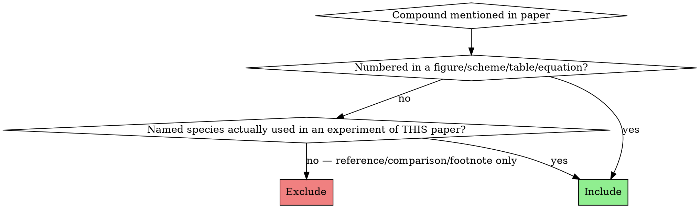

# paper-fetch-smiles

## Purpose

Turn a chemistry paper PDF into a single Python module (`compounds.py`) that downstream pipelines can import. The output is the **input** to `chemstructure-database-creation` — that skill resolves the table against PubChem and tmQMg-L. This skill is the upstream extractor that produces the raw `[{paper_id, role, name, fallback_smiles}, …]` list.

## When to use

- A user hands you a paper PDF and asks for SMILES of every compound.
- You need `compounds.py` for a molSimplify `exploration_notebook/<system>/` directory.
- A downstream notebook expects `PAPER_COMPOUND_TABLE` + `EXPECTED_ELECTRONIC_STRUCTURE` from a paper.

## When NOT to use

- Just one or two SMILES from a figure → `authoring-smiles` directly.
- Editing an existing SMILES (NL instruction) → `fast-smiles`.
- Resolving names you already have against PubChem → `chemstructure-database-creation`.

## Output file shape (HARD requirement)

The file `compounds.py` MUST contain exactly two module-level constants:

```python
# <relative_path>/compounds.py
"""Hard-coded chemistry data for the <FirstAuthor> <Year> <topic> paper."""
from __future__ import annotations
from typing import Any

PAPER_COMPOUND_TABLE: list[dict[str, Any]] = [
    {"paper_id": "<ID>", "role": "<role>",
     "name": "<descriptive name>",
     "fallback_smiles": "<RDKit-parseable SMILES>"},
    ...
]

EXPECTED_ELECTRONIC_STRUCTURE: dict[str, dict[str, Any]] = {
    "<species_key>": {"oxidation_state": <int>, "d_count": <int>,
                      "geometry_class": "<str>",
                      "spin_state": "<str>"},
    ...
}
```

Every row in `PAPER_COMPOUND_TABLE` has all four keys present. No optional fields, no `null`.
`EXPECTED_ELECTRONIC_STRUCTURE` is present even if empty (`{}` for purely organic papers).

## Allowed `role` vocabulary

Use exactly one of:

| role | When |
|---|---|
| `catalyst_precursor` | Metal complex actually added to the flask (Ni(COD)2, [Rh(cod)Cl]₂, …) |
| `ligand` | Added co-ligand (NHC, phosphine, bipyridine, …) — also use for the free ligand of a precursor when discussed separately (e.g., COD as a separate entry from Ni(COD)2) |
| `diyne`, `dienyne`, `enyne` | Substrate class — match the paper's chemistry vocabulary |
| Other substrate roles | `alkene`, `alkyne`, `aldehyde`, … — pick what the paper studies |
| Product roles | `pyrone`, `pyridone`, `arene`, `lactone`, … — what the paper makes |
| `intermediate` | On-cycle mechanistic species (drawn in the catalytic cycle) |
| `off_cycle` | Drawn off the productive cycle (deactivation, resting state) |

If unsure, pick the noun the paper uses in its own scheme captions.

## Inclusion criteria (closes the over-extraction failure mode)



**Include:**
- Every compound bearing a bold-numeric label in a Table, Scheme, Figure, or Equation (1, 2, …).
- Named species actually charged to a flask in this paper's experiments (Ni(COD)2, IPr, IMes if all three are tested).
- Free ligands of those precursors if the paper discusses them by name (COD as a separate entry from Ni(COD)2 — they are different molecules with different roles).

**Exclude:**
- Compounds named only in the introductory paragraph, footnotes, or references as comparison/context (e.g., "unlike Pd2(dba)3 …" — Pd2(dba)3 is excluded unless the paper actually tested it).
- Solvents and bulk reagents (toluene, benzene, THF, CO2 itself, K2CO3) — they are reaction conditions, not catalog entries.
- **Alternative-route reagents from footnotes.** If a footnote says "alternatively, X + Y in lieu of Z can be used" — X and Y are NOT separate rows. The row in the table is Z (the carbene/ligand actually formed). Example: "IPr·HBF4 + KO-t-Bu in lieu of IPr" → only IPr goes in the table. The salt-route reagents are equivalent prep methods, not distinct compounds.
- **In-situ adducts** of two table entries are NOT new rows. If the paper makes M(L)n by mixing M(COD)n + L in the flask (even if the resulting M(L)n is also isolable elsewhere), it's an in-situ adduct of two entries that are ALREADY in the table — it does not get its own row. Example for Louie 2002: Ni(IPr)2 = Ni(COD)2 + IPr in situ. Ni(COD)2 and IPr each get a row; Ni(IPr)2 does NOT. The adduct is documented in `EXPECTED_ELECTRONIC_STRUCTURE` only.
  - Counter-check: if every atom in candidate X also appears in two existing table entries that the paper mixes together, X is an adduct — exclude.
  - This holds even if the paper describes X as "isolated" or "well-defined" — those words describe characterization, not whether X is a distinct compound from its components.

**Red flag:** you're about to add a row whose only justification is "the paper mentions it once in passing", or "the paper isolated it", or "footnote alternative route". Cut it.

**Self-test before finalizing the table:** for each candidate row, answer one of:
1. "It has a bold-number label in Table N / Scheme N / Eq N." → include.
2. "It is named in the methods/main text AND charged to the flask as a discrete reagent (not made from two other table entries)." → include.
3. Otherwise → exclude. No exceptions for footnote alternatives, isolated adducts, or comparison reagents.

## Coverage sweep (closes the missing-compound failure mode)

Before writing the file, locate compounds in EVERY part of the paper. Use a TodoWrite checklist:

1. **Title & abstract** — note the chemistry class (informs the role vocabulary).
2. **Every Table** — for each entry row, identify substrate id AND product id. R-group columns generate multiple compounds (R=Me → one compound, R=Et → another).
3. **Every Scheme** — mechanism boxes typically introduce metallacycle intermediates (often the highest paper_ids).
4. **Every figure** — sometimes a key catalyst structure has its own panel.
5. **Every numbered equation** (eq 1, eq 2, …) — often introduces "control" or "asymmetric" substrates/products outside the main table.
6. **Named species in the text** — search for "M(L)n", "[M(L)nXm]", and named ligand abbreviations (IPr, IMes, IDip, Xantphos, dppe, …). Cross-check the inclusion criteria.

After the sweep, you should have a paper_id list whose maximum equals the highest number used in the paper. **Missing numbers in the middle of the sequence is a hard failure** — re-read to find them.

## R-group expansion (closes the R-group-confusion failure mode)

When a structure has an `R` (or `R'`, `R''`) marker and a paper_id, and a table lists multiple R values:

- Each (paper_id, R-value) is a separate compound iff the paper assigns it its own bold number.
  - Table 1 of Louie 2002 shows: substrate `1` (R=Me), `2` (R=Et), `3` (R=iPr) → 3 separate diynes; products `10`/`11`/`12` likewise.
- `R` on multiple positions of one drawing means the same group at each position (read the legend literally: "R = Me" → all R-labelled atoms in that drawing are methyl).
- If the figure shows a single MeO2C explicitly drawn on one side and `R` on the alkyne termini, only the alkyne-termini Rs vary — the explicit MeO2C is fixed. Don't multiply variation onto fixed positions.

When you're unsure how a R-symbol maps to atoms (e.g., does R sit on the alkyne terminus or the tether carbon?), use the product structure of the corresponding pyrone/arene to infer where the R went in the substrate. Cycloadditions preserve atoms — the product reveals the substrate's R-positions.

## Authoring SMILES — required ritual

**REQUIRED SUB-SKILL:** Use `authoring-smiles` for every fallback_smiles. The skill's "five-rule construction order" and verification ritual apply unchanged.

For this skill specifically:
- **Skeleton first, stereo last.** Don't add `[C@H]` unless the paper explicitly draws wedges for that compound. A correct flat SMILES beats a wrong stereo SMILES.
- **Disconnected components** for ionic and weakly-bound complexes: `[K+].CC(C)(C)[O-]` for KO-t-Bu; `[Ni].C1CC=CCCC=C1.C1CC=CCCC=C1` for Ni(COD)2 if the connectivity to Ni isn't drawn explicitly in the paper.

**For organometallic intermediates** drawn in a mechanism (`paper_id` is a numbered metallacycle):
- Build the SMILES as the **organic ring with `[Ni]` (or `[Pd]`, `[Rh]`, …) embedded as a ring atom**, preserving the connectivity drawn in the scheme. This keeps the chemistry readable and lets RDKit parse it.
- Example (oxa-nickelacyclopentene): `O=C1[Ni]=CCO1` — five-membered ring C=O, Ni double-bonded to next C, then C, O closing back to carbonyl C.
- Example (7-membered metallacycle): `O=C1OC(=CC=C[Ni]1)` — preserves the seven-atom ring.
- Example (nickelacyclopentadiene): `CC1=C2CCCC2=C(C)[Ni]1` — fused bicyclic with Ni in the 5-ring.
- **Do NOT** collapse to bare `[Ni]` — that loses the connectivity that justifies the entry.
- Hydrogens on M and exotic valences: write the ring with the bonds the scheme shows; RDKit will accept unusual valences on bracket atoms. Verify by `Chem.MolFromSmiles(smi, sanitize=False)` if strict sanitization fails — the goal is a faithful 2D representation for visualization, not a quantum-mechanically correct structure.

## EXPECTED_ELECTRONIC_STRUCTURE — fill it whenever there is a metal

For every transition-metal-bearing species (precursor, in-situ adduct, on-cycle metallacycle, off-cycle resting state), add one entry:

```python
"<species_key>": {
    "oxidation_state": <int>,
    "d_count":        <int>,           # d^n on the metal
    "geometry_class": "<str>",         # tetrahedral / square_planar / trigonal_planar / linear / octahedral / sandwich / …
    "spin_state":     "<str>",         # closed_shell_singlet / open_shell_singlet / triplet / quartet / …
}
```

Conventions:
- Keys mirror the paper's vocabulary: `"Ni(COD)2"`, `"Ni(IPr)2"`, `"Ni(IPr)_eta2_alkyne"`, `"nickelactone_19"`, `"metallacycle_20"`, `"nickelole_21"`. Numbered species get `_<paper_id>` appended for traceability.
- Include the in-situ adduct (Ni(IPr)2) even though it's NOT a row in `PAPER_COMPOUND_TABLE` — this is where it lives.
- A purely organic paper still defines the dict, as `EXPECTED_ELECTRONIC_STRUCTURE = {}`.

Quick reference for common d^n / geometry combos:

| Metal-OS | d^n | Typical geometry | Spin |
|---|---|---|---|
| Ni(0)   | d10 | tetrahedral (4L) / trigonal_planar (3L) / linear (2L NHC) | closed_shell_singlet |
| Ni(II)  | d8  | square_planar  | closed_shell_singlet (most NHC/PR3); tetrahedral high-spin (rare) |
| Pd(0)   | d10 | as Ni(0)       | closed_shell_singlet |
| Pd(II)  | d8  | square_planar  | closed_shell_singlet |
| Fe(II)  | d6  | octahedral     | low-spin or high-spin per ligand field |
| Cu(I)   | d10 | tetrahedral / trigonal_planar / linear | closed_shell_singlet |

When the paper draws an intermediate without specifying the spectator-ligand count, infer the metal coordination number from "Ni(L)n" + the explicit ligands in the ring: a square-planar Ni(II) metallacycle (e.g., a nickelactone) has 2 ring donors and 2 spectator donors → 4-coordinate, d8, closed-shell singlet.

## Workflow

1. Read the paper end-to-end (Read tool with `pages` for big PDFs). Note: title, abstract, every Table/Scheme/Figure/equation, mechanism diagram, supporting info pointers.
2. Run the **Coverage sweep** (above) — write a `TodoWrite` per source (Table 1, Scheme 1, eq 2, named-species text) so nothing is skipped.
3. Apply the **Inclusion criteria** — drop comparison/footnote-only mentions.
4. Apply **R-group expansion** to every R-bearing row in a Table.
5. For each compound, draft SMILES using `authoring-smiles`. Verify with RDKit:
   ```python
   from rdkit import Chem
   for row in PAPER_COMPOUND_TABLE:
       mol = Chem.MolFromSmiles(row["fallback_smiles"], sanitize=False)
       assert mol is not None, row["paper_id"]
   ```
   `sanitize=False` for organometallic rings; switch to `sanitize=True` for purely organic compounds.
6. Build `EXPECTED_ELECTRONIC_STRUCTURE` for every metal species (precursor, adducts, on/off-cycle metallacycles).
7. Write `compounds.py` to the user-specified path.
8. **Cross-check** before reporting done:
   - `len(PAPER_COMPOUND_TABLE) == <expected count>` — paper_id max + named entries.
   - Every numeric paper_id from 1 to max is present (no gaps).
   - Every metal-bearing row has a corresponding `EXPECTED_ELECTRONIC_STRUCTURE` entry.
   - Every `fallback_smiles` parses with RDKit.

## Common mistakes

| Mistake | Fix |
|---|---|
| Stops after Table 1, misses Scheme 1 intermediates | Coverage sweep — every Scheme is a source. |
| Misses named ligands (Ni(COD)2, IPr) because they aren't numbered | Inclusion criterion 2: actually-used named species are included. |
| Includes Pd2(dba)3 / Ni(PCy3)2(CO)2 because they're mentioned in references | Exclusion rule: reference/comparison-only mentions are out. |
| Writes `"fallback_smiles": "[Ni]"` for a metallacycle | Embed `[Ni]` in the organic ring instead. |
| Forgets `EXPECTED_ELECTRONIC_STRUCTURE` | Required even if `{}`. Required entry for every metal species. |
| R = Me ⇒ writes only one compound when the table says R = Me, Et, iPr | Each R-value gets its own row IF it has its own bold number. |
| Confuses substrate `1` (R=Me diyne) with product `10` (R=Me pyrone) — both have R=Me but different scaffolds | Treat the paper_id as the primary key, not the R-value. |
| Skips IMes because IPr was the "main" ligand | Both are charged to flasks (Table footer, screening discussion) — both included. |
| Adds stereochemistry without paper support | Skeleton-only is correct unless wedges are drawn. |

## Red flags — STOP and re-check

- About to write `[Ni]` (or `[Pd]`, …) as the entire SMILES for a metallacycle.
- About to omit `EXPECTED_ELECTRONIC_STRUCTURE`.
- About to add a row whose only source is the references section.
- About to skip a Scheme because "it's just the mechanism."
- About to include a solvent or bulk reagent.
- About to add a row for an **adduct** of two existing rows (e.g., Ni(IPr)2 when Ni(COD)2 and IPr are already rows). The adduct goes in `EXPECTED_ELECTRONIC_STRUCTURE`, not the table.
- About to add a row from a footnote whose phrasing is "alternatively …" or "in lieu of … can also be used" — the alternative reagents are NOT compounds, the named ligand they generate IS.

## Related skills

- `authoring-smiles` — REQUIRED sub-skill for hand-drawing every SMILES.
- `fast-smiles` — useful when revising an R-group variant from a parent SMILES.
- `chemstructure-database-creation` — downstream consumer; takes this skill's `PAPER_COMPOUND_TABLE` and produces a canonical JSON DB via PubChem + tmQMg-L.
- `rdkit` — for the verification ritual (parse, canonicalize, render).
