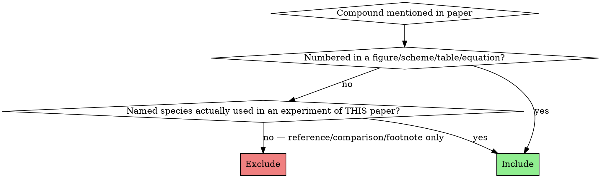

# paper-fetch-smiles

## Purpose

Turn a chemistry paper PDF into a resolved compound catalog. The skill produces three artifacts in tandem:

1. **`compounds.py`** — hand-authored from the paper. The **ground truth** (`PAPER_COMPOUND_TABLE` + `EXPECTED_ELECTRONIC_STRUCTURE`). Edit this if a compound needs correcting, then regenerate the other two.
2. **`compounds.json`** — `compounds.py` resolved against PubChem and (optionally) tmQMg-L by `scripts/cli.py build`. Carries the hand-authored fields, the PubChem-resolved fields, the run `metadata`, AND the `expected_electronic_structure` block (so downstream consumers need only this one file). This is what downstream notebooks load.
3. **`compounds.png`** — 2D-structure grid rendered by `scripts/cli.py render`. Mandatory visual-verification artifact.

`compounds.py` is the input to the resolver; the resolver populates `compounds.json` from PubChem + tmQMg-L and carries the electronic structure through; the renderer turns the resolved data into a structure grid. The skill drives all three steps in one run.

## When to use

- A user hands you a paper PDF and asks for SMILES of every compound.
- A downstream notebook expects `PAPER_COMPOUND_TABLE` + `EXPECTED_ELECTRONIC_STRUCTURE` from a paper.

## When NOT to use

- Just one or two SMILES from a figure → `authoring-smiles` directly.
- Editing an existing SMILES (NL instruction) → `fast-smiles`.

## Output files (HARD requirement)

A successful run produces **three artifacts** in the user-specified directory:

| File | Purpose | How it is produced |
|---|---|---|
| `compounds.py` | Hand-authored **ground truth** (`PAPER_COMPOUND_TABLE` + `EXPECTED_ELECTRONIC_STRUCTURE`). Human-readable, typed, version-controllable. | Written by this skill from the paper. |
| `compounds.json` | Resolved DB — PubChem-canonical SMILES / InChI / CID / MW, optional tmQMg-L crystal data, RDKit review block per row, run metadata, plus the carried-through `expected_electronic_structure`. | Produced by `scripts/cli.py build` from `compounds.py` (Workflow step 9). |
| `compounds.png` | RDKit 2D-structure grid for visual verification. | `scripts/cli.py render` (Workflow step 10). |

**All three must exist** when the skill reports done. The PNG is what reviewers check first; the JSON is what downstream notebooks load; the PY is the ground truth that the JSON and PNG are regenerated from.

### `compounds.py` shape

```python
# <relative_path>/compounds.py
"""Hard-coded chemistry data for the <FirstAuthor> <Year> <topic> paper."""
from __future__ import annotations
from typing import Any

PAPER_COMPOUND_TABLE: list[dict[str, Any]] = [
    {"paper_id": "<ID>", "role": "<role>",
     "name": "<descriptive name>",
     "fallback_smiles": "<RDKit-parseable SMILES>"},
    ...
]

EXPECTED_ELECTRONIC_STRUCTURE: dict[str, dict[str, Any]] = {
    "<species_key>": {"oxidation_state": <int>, "d_count": <int>,
                      "geometry_class": "<str>",
                      "spin_state": "<str>"},
    ...
}
```

Every row in `PAPER_COMPOUND_TABLE` has all four keys present. No optional fields, no `null`.
`EXPECTED_ELECTRONIC_STRUCTURE` is present even if empty (`{}` for purely organic papers).

### `compounds.json` shape

Emitted by the resolver CLI. Top-level keys are `metadata` (run statistics), `expected_electronic_structure` (carried through verbatim from `compounds.py`), and `compounds` (a list, one entry per `PAPER_COMPOUND_TABLE` row, enriched with PubChem fields `iupac`, `smiles`, `canonical_smiles`, `isomeric_smiles`, `inchi`, `inchikey`, `cid`, `mw`, plus `source`, optional `tmqml` block, and an RDKit `review` block). Inspect `test/ni-louie/compounds.json` for the canonical example (note: that fixture predates the EES carry-through and so has no `expected_electronic_structure` key).

Unresolved rows still appear in `compounds.json` with `source: "fallback"` and the hand-authored `fallback_smiles` carried through — never silently dropped.

## Figure extraction (upstream of `compounds.py`)

Many catalytic-cycle papers draw the mechanism only in a **free-energy diagram** — colored curves over a reaction coordinate, labels along the curves. The order of labels along each colored line IS the mechanism for that pathway, and the highest peak per line is the rate-limiting TS for free. `cli.py extract-figs` makes those figures available to an analyzer subagent.

This step sits **before** `compounds.py` — its outputs help identify which species the paper discusses, what the cycle looks like, and what the energy profile says. No `--require-compounds` guard.

### What the subcommand does

```bash
micromamba run -n paper-fetch-smiles python -m scripts.cli extract-figs \
  --paper-pdf <paper>/paper.pdf  --out-dir <paper>/figs \
  --rasterize-pages   --caption-anchored \
  --paper-name "<First Author Year>"  --log <paper>/paper_fetch_log.md
```

**Try `pdfimages` FIRST; crop only as a fallback.** Embedded-raster extraction is
cheap and lossless — always run it first. Only rasterize whole pages and crop when
the figures are *vector art* that `pdfimages` can't see. `--auto` makes this decision
for you: it runs `pdfimages -all`, and if there are fewer figure-grade embedded
images than `Figure`/`Scheme` captions, it falls back to `--rasterize-pages
--caption-anchored --column-aware`; otherwise it keeps the `pdfimages` output and
skips cropping. The chosen path is logged to `paper_fetch_log.md`. Prefer `--auto`
over hand-picking the passes below.

```bash
micromamba run -n paper-fetch-smiles python -m scripts.cli extract-figs \
  --paper-pdf <paper>/paper.pdf  --out-dir <paper>/figs  --auto \
  --log <paper>/paper_fetch_log.md  --paper-name "<First Author Year>"
```

Three independent passes (used directly only when overriding `--auto`), each opt-in:

| Pass | Flag | What it produces | Why it can fail |
|---|---|---|---|
| `pdfimages -all` | always on | every embedded raster (PNG / JPG / JB2 / …), pruned by `--min-width-px` (default 100) + `--min-size-bytes` (default 2 KB). `.ccitt`/`.params` sidecars deleted. | Misses vector-art figures (energy diagrams in modern papers are typically vector). |
| `pdftoppm -png` | `--rasterize-pages [--pages N-M] [--page-dpi 150]` | one PNG per page at the requested DPI. Captures vector art. | Page rasters include body text + caption + figure — verbose. |
| caption-anchored crop | `--caption-anchored [--column-aware] [--keep-page-rasters]` | exactly ONE crop per `Figure N.` / `Scheme N.` caption found by `pdftotext -bbox-layout`, named `fig-Figure-N.png` / `fig-Scheme-N.png`. Each crop spans from the bottom of the previous text block down to (and including) the caption — auto-trims any next-section heading that pdftotext merged into the caption block. By default widens x to the page content area (5 % margins) so left-edge labels aren't clipped. Page rasters deleted afterwards unless `--keep-page-rasters`. Verified 8/8 against `figs_truth/gt_N.png` on the ni-zhang fixture. | Captions whose first word "Figure"/"Scheme" isn't at the block's left edge (e.g. centred captions) are missed — pdftotext block layout has to put the anchor word first. |

The bbox XML from `pdftotext -bbox-layout` is sanitized of XML-1.0-illegal control bytes (e.g. a raw `0x02` from a superscript glyph) before parsing — without this, `ElementTree` aborts the whole document with "not well-formed (invalid token)" and every caption is lost. This bit the Fan 2012 review (38 schemes, 0 recovered) before the fix.

**`--column-aware`** (opt-in, with `--caption-anchored`): journals lay figures out either **full-width** (drawing spans both columns; caption is wide — ni-zhang captions are 66 % of page width) or **single-column** (drawing in one column; caption is narrow and centred in that column — Fan's `Scheme 5` caption is 5 % of page, centred at 71 %). Caption width is the discriminator: a caption ≥ 40 % of page width → full-width figure, keep the page-content x-extent; a narrower caption → clip x to the caption's column so the neighbouring text column isn't dragged into the crop. A blind midpoint split would halve full-width figures — this does not. Regression-tested by `scripts/test_column_crop.py`: ni-zhang's 8 figures stay full-width (still match `figs_truth/gt_N.png`) while Fan's two-column schemes clip to a single column.

Catalog file: `figs/figs.json`. Top-level `_units` block (`width:px, height:px, size:B`). The catalog's `top_candidates` list is the largest-by-size PNG/JPG entries — the subagent uses it as a starting point.

### Energy-diagram analyzer subagent (≤ 5 minutes)

> Skim every `page-NN.png` (or `figure-page-NN-K.png`) and find the energy-diagram pages — axes labeled `ΔG` / kcal·mol⁻¹, "reaction coordinate" on X, labels INT* / TS* / numbers along curves. Read the caption (`pdftotext -raw paper.pdf - | grep -i "figure N"`) for which diyne / ligand / pathway the diagram covers. For each diagram, for each distinct line **color**, list the labels left-to-right along the line + their printed ΔG, then identify the rate-limiting TS (max ΔG among TS labels on that line) and most-stable INT (min ΔG among INT labels on that line). Write `mechanism_from_diagram.json` per the schema below. Append VERIFIED per diagram + REVIEW per illegible label to `paper_fetch_log.md`. Hard cap: 5 minutes.

Schema of `mechanism_from_diagram.json`:

```json
{
  "_units": {"energy": "kcal/mol", "axis_y": "ΔG_THF",
             "axis_x": "reaction coordinate"},
  "diagrams": [
    {"figure": "page-08.png",
     "caption_summary": "Figure 4. Free-energy profile, diyne 4 + CO2, L1=PMe3, paths C and D.",
     "diyne": "4", "ligand": "L1=PMe3",
     "pathways_by_color": {
       "black": {"pathway_label": "4c",
                 "sequence": ["Ni(L1)2", "INT1-4c", "TS4-4c", "INT6-4c", ...],
                 "energies_kcal_mol": [0.0, 12.4, 25.2, 18.0, ...],
                 "rate_limiting_ts": "TS4-4c",
                 "most_stable_int": "INT8-4c"},
       "red":   { ... }
     }}
  ]
}
```

Forks and merges fall out of the schema for free: two pathway entries that share a `sequence` prefix are forking off the same intermediate; two that converge to the same trailing label are merging. Hand `mechanism_from_diagram.json` to the SI **planner subagent** as the source of `mechanism_sequence` in `mechanism.json` — the planner only has to add `join`/`leave` annotations and re-key into the SI's verbatim labels.

### Common mistakes — figure extraction

| Mistake | Fix |
|---|---|
| `pdfimages -all` returns thousands of tiny rasters and no figure | The defaults already prune width < 100 px and size < 2 KB; if there are STILL too many, raise `--min-width-px`. Atom sprites are typically 30–80 px. |
| `pdfimages` returns 0 useful figures because everything is vector | Add `--rasterize-pages`. Energy diagrams in modern journals are almost always vector. |
| `--caption-anchored` finds 0 captions | The first word "Figure"/"Scheme" of each caption must be the leftmost word of its `pdftotext -bbox-layout` block. Some publishers centre captions or rasterise the figure number into the image — there's nothing for pdftotext to anchor on. Fall back to `--rasterize-pages` alone (no `--caption-anchored`) and let the analyzer subagent identify the right pages by content. |
| Trying to extract reaction schemes (not energy diagrams) | Use `cli.py extract-schemes` (below) for `Scheme N` catalytic cycles, or the `reaction-data-extraction` skill (RxnScribe) for clean `A + B → C` schemes. `extract-figs --caption-anchored` is tuned for `Figure N` energy diagrams. |

### Reaction / catalytic-cycle scheme extraction (`extract-schemes`)

Where `Figure N` marks an energy diagram, **`Scheme N` marks a reaction** — a
catalytic cycle, an insertion mode, a stoichiometric transformation. `extract-schemes`
is the scheme-side counterpart of `extract-figs`, with two hard differences:

- **Region-only rendering — never whole pages.** For each `Scheme N` caption it renders
  ONLY that scheme's bounding box via `pdftoppm -x -y -W -H` (a PDF-level region crop).
  No `page-NN.png` is ever produced. The x-extent is clipped to the caption's column so
  a two-column layout doesn't drag the neighbouring text column into the crop.
- **The product is reactions, not pictures.** Each `scheme-N.png` is paired with a row in
  `schemes.json` whose `reactions[]` list — the ordered elementary steps of that cycle —
  is filled by the scheme analyzer subagent.

```bash
micromamba run -n paper-fetch-smiles python -m scripts.cli extract-schemes \
  --paper-pdf <paper>/paper.pdf  --out-dir <paper>/schemes \
  --numbers "5,15,19-25"   --page-dpi 150 \
  --log <paper>/paper_fetch_log.md  --paper-name "<First Author Year>"
```

`schemes.json` shape (one row per scheme; `reactions[]` filled by the analyzer):

```json
{
  "_units": {"bbox": "pt", "crop": "px"},
  "source_pdf": "...", "n_schemes": 38,
  "schemes": [
    {"scheme": 5, "page": 4, "crop": "scheme-5.png", "caption": "Scheme 5",
     "is_catalytic_cycle": true,
     "reactions": [
       {"step": 1, "from": ["1", "CO2"], "to": ["B"], "kind": "CO2_coordination",
        "note": "path b (favoured): CO2 activated by allyl pi; barrier 28.4 kcal/mol"},
       {"step": 2, "from": ["B"], "to": ["2"], "kind": "rearrangement",
        "note": "allyl -> bridging carboxylate"}
     ]}
  ]
}
```

`reactions[]` uses the SAME `from`/`to` species-label vocabulary as the SI `mechanism.json`,
so a cycle traced off a scheme can be promoted into `mechanism.json` once SI `.xyz` labels exist.

#### Scheme-reaction analyzer subagent (≤ 5 minutes)

> For each `scheme-N.png` in `schemes/`, decide if it is a catalytic cycle (closed loop of
> arrows) or a one-shot reaction / coordination cartoon — set `is_catalytic_cycle`. If it
> depicts reactions, trace the arrows in order and write `reactions[]`: one entry per arrow
> with `from`/`to` species labels (use the paper's labels — `1`, `A`, `INT1-1a`, `CO2`,
> `Ni(COD)2`), an elementary-step `kind` (CO2_coordination / oxidative_coupling / insertion /
> beta_H_elimination / reductive_elimination / ligand_exchange / metathesis), and a `note`
> (barrier, regiochem, path label). Forks/merges = two entries sharing a `from`/`to` label.
> Read the caption + surrounding text (`pdftotext -raw paper.pdf - | grep -i "scheme N"`) for
> the species identities. Append VERIFIED per cycle + REVIEW per illegible label to
> `paper_fetch_log.md`. Hard cap: 5 minutes.

## SI extraction (when the paper has a computational SI)

If the user also provides a supporting-information PDF with optimised structures and a DFT energy table, four extra artifacts land next to the three above:

| File | Purpose | Produced by |
|---|---|---|
| `structures/*.xyz` | One file per stationary point. **Line 2 carries `charge=N multiplicity=M`** (HARD rule). | `cli.py extract-xyz` |
| `table.json` | DFT energies, free energies, optional imag-freq column. Keyed by SI label. | `cli.py extract-table` |
| `index.json` | Joins `structures/*.xyz` ↔ `table.json` ↔ `compounds.json` (+ optional `mechanism.json`). | `cli.py build-index` |
| `paper_fetch_log.md` | Append-only REVIEW / VERIFIED log. Every script and both subagents write here. | All of the above |

The pipeline is **planner subagent → bash extraction → reviewer subagent**. The bash step is deterministic; LLMs only decide knobs and verify outputs.

### The `.xyz` HARD rule — every `.xyz` self-describes charge and multiplicity

Every `.xyz` this skill writes embeds `charge` and `multiplicity` in the line-2 comment. The comment line is otherwise free, and a bare comment ("optimised geometry", "from PubChem CID 12345") is **not enough**:

```
41
charge=0 multiplicity=1  name=Ni(COD)2  (extracted from Zhang 2024 Inorganics SI)
Ni      0.00008700     -0.00019300      0.00015700
...
```

- Line 1: atom count (unchanged from XYZ spec).
- Line 2: `charge=<int> multiplicity=<int>` MUST appear first; any free text after is fine.
- `multiplicity = 2S+1` (singlet=1, doublet=2, triplet=3, …) — **not** the unpaired-electron count `S`.

If charge or multiplicity is unknown for a label, `extract-xyz` does **not** write the file — it logs a REVIEW item to `paper_fetch_log.md` and moves on. No silent neutral-singlet fallback. xtb sidecar `.CHRG` / `.UHF` files are still fine for tooling that needs them, but the `.xyz` itself must always be self-describing.

### CLI subcommands

All three accept `--log paper_fetch_log.md` and `--paper-name "<First Author Year>"`. All paper-specific knobs are CLI flags — no per-paper config files.

```bash
# DFT energy table.  Columns default to "E,G,CGFE,ETHF,GTHF,Ifreq?" (trailing
# `?` = optional col only on some rows).  --banner stops parsing at the start
# of the coord section.
micromamba run -n paper-fetch-smiles python -m scripts.cli extract-table \
  --si-pdf <paper>/si.pdf  --output <paper>/table.json \
  --columns "E,G,CGFE,ETHF,GTHF,Ifreq?" \
  --log <paper>/paper_fetch_log.md  --paper-name "<First Author Year>"

# Per-structure .xyz with charge/multiplicity in line 2.  --cm-json is a
# {"<label>": {"charge": int, "multiplicity": int}} map authored by the
# planner subagent; --default-* covers everything else.
micromamba run -n paper-fetch-smiles python -m scripts.cli extract-xyz \
  --si-pdf <paper>/si.pdf  --out-dir <paper>/structures \
  --cm-json <paper>/cm.json  --default-charge 0  --default-multiplicity 1 \
  --log <paper>/paper_fetch_log.md  --paper-name "<First Author Year>"

# Join everything.  --aliases handles residual coord-vs-table label mismatches
# (e.g. Zhang's SI files `Ni(L1)2` in the table but `Ni(PMe3)2` in the coords).
# --mechanism is optional; see next subsection.
micromamba run -n paper-fetch-smiles python -m scripts.cli build-index \
  --structures <paper>/structures  --table <paper>/table.json \
  --compounds <paper>/compounds.json  --output <paper>/index.json \
  --aliases "NiPMe32=Ni(L1)2" \
  --mechanism <paper>/mechanism.json \
  --log <paper>/paper_fetch_log.md  --paper-name "<First Author Year>"
```

### `mechanism.json` — catalytic cycle as data (optional)

If the planner subagent encodes the paper's mechanism, `build-index` annotates every structure with `pathways`, `next_steps`, `prev_steps`, `spin_partners` AND runs **mass-balance verification** for every step. Schema:

```json
{
  "mechanism_sequence": [
    {"pathway": "1a",
     "steps": [
       {"from": "Ni(COD)2",  "to": "Ni(PMe3)2",
        "join": ["PMe3", "PMe3"], "leave": ["COD", "COD"]},
       {"from": "Ni(PMe3)2", "to": "INT1-1a", "join": ["1"]},
       {"from": "INT2-1a",   "to": "TS1-1a"},
       {"from": "TS1-1a",    "to": "INT3-1a"}
     ]},
    {"pathway": "1b",
     "steps": [
       {"from": "INT2-1a",   "to": "TS1-1b"},   /* fork from 1a */
       {"from": "TS1-1b",    "to": "INT3-1a"}   /* merges back  */
     ]}
  ],
  "spin_pairs": [
    ["INT5-1f", "INT5-1f-triplet"]
  ]
}
```

**Encode every pathway the paper documents.** Forks and merges are first-class: any node listed as `from`/`to` in two different pathways is automatically a fork (multiple `next_steps`) or merge (multiple `prev_steps`) — no explicit node-type marker is needed. The planner subagent **must enumerate every pathway** in the paper's mechanism scheme(s), not just the primary one; partial mechanisms miss bypass routes and off-cycle deactivation.

Every label in `from / to / join / leave / spin_pairs` must match a `.xyz` stem (sanitised paper_id is the lookup key). Mass balance enforces three invariants per step:

1. **Per-element atom count**: `from.elements + Σ join.elements == to.elements + Σ leave.elements`
2. **Net charge**: same with `.charge`
3. **Electron parity vs multiplicity parity**: `(ΣZ − charge) mod 2 == (multiplicity − 1) mod 2`, both per-step and per-species

Real imbalances go in `paper_fetch_log.md` under REVIEW with a per-element delta. Lookup misses are flagged separately ("aliasing issue — fix with `--aliases`") so they're not counted as chemistry failures.

### `paper_fetch_log.md` contract

```markdown
# paper-fetch-smiles log — <paper>

Generated <ISO timestamp>

## REVIEW — needs human attention

- [ ] si_table: duplicate row for label `INT7-4e` — keeping first  _(scripts/si_table.py)_
- [ ] si_xyz: skipping `INT3-1e` — no entry in --cm-json and no defaults  _(scripts/si_xyz.py)_
- [ ] si_index/mass-balance [pathway 1b]: INT2-1a → TS1-1a: per-element imbalance (lhs−rhs by element): {'H': 2}  _(scripts/si_index.py)_

## VERIFIED — reviewer-confirmed

- INT3-1a: 47 atoms, charge=0 multiplicity=1, first atom Ni 0.000 0.000 0.000 — matches SI page S7.
- Table S1 row TS3-1e: E=-1785.100422, Ifreq=-363.66 — matches SI page S2.
```

Every REVIEW item has a checkbox + script source. Every VERIFIED item has the specific evidence the reviewer checked. Both subagents read this file before writing; nothing in the file is ever deleted, only checked off.

### Subagent contracts

**Planner subagent (≤ 5 minutes).** Reads the SI, decides extraction knobs, writes a starter `paper_fetch_log.md`. Output: `cm.json` (`{label: {charge, multiplicity}}`), optional `mechanism.json`, and initial REVIEW items for ambiguities (e.g., coord-vs-table label mismatches).

> Read the SI PDF at <path>. Identify (a) the banner phrase that marks the start of the coordinate section; (b) the column schema of the DFT table (with units — Hartree / cm⁻¹ / kcal·mol⁻¹ — captured in `--units col=unit,...`); (c) the regex for structure labels; (d) the charge and multiplicity for every structure name; (e) **every pathway in the paper's mechanism scheme(s)** — encode all of them in `mechanism_sequence`, with forks/merges expressed as shared `from`/`to` labels across pathway entries (see `### mechanism.json`); (f) any coord-vs-table label mismatches as alias hints. Write `cm.json` and `mechanism.json`. For anything ambiguous, append a REVIEW item to `paper_fetch_log.md` with the reason. Hard cap: 5 minutes.

**Reviewer subagent (≤ 5 minutes).** Verifies extraction correctness against the SI PDF. Output: appends VERIFIED items + new REVIEW items to `paper_fetch_log.md`.

> Sample 3 random `.xyz` files from `structures/` — for each, verify atom count, first/last atom element + coords, and the line-2 `charge=N multiplicity=M` against the SI. Sample 3 random `table.json` rows — verify floats against the SI Table. Scan `index.json` for entries with `compound_match=false` that look like discrete species (1, 2, COD, …) and flag them. Append VERIFIED / REVIEW items to `paper_fetch_log.md`. Hard cap: 5 minutes.
>
> **Write VERY SHORT notes** — one line each, no prose. A VERIFIED item is `<label>: <what> = <value> — matches SI p.SN`. A REVIEW item is `<area>: <one-line problem>`. No paragraphs, no restating the contract, no summaries. Terse and greppable.

## Allowed `role` vocabulary

The `role` is not free-form text. Every compound in the paper plays exactly one part in the chemistry, and the field must come from the closed set below. The four **meta-categories** are the only options:

| Meta-category | Question to ask | Concrete `role` values |
|---|---|---|
| **Catalyst system** | "Is this what enables the reaction (added to the flask, but not consumed stoichiometrically)?" | `catalyst` (generic), `catalyst_precursor`, `ligand` |
| **Educt (substrate)** | "Is this what gets consumed and transformed?" | `educt` (generic), or a substrate noun the paper uses (`diyne`, `dienyne`, `enyne`, `alkene`, `alkyne`, `aldehyde`, `imine`, `arene`, `CO`, `CO2`, …) |
| **Product** | "Is this what the reaction makes?" | `product` (generic), or a product noun the paper uses (`pyrone`, `pyridone`, `arene`, `lactone`, `amine`, …) |
| **Mechanistic species** | "Is this drawn inside the catalytic cycle as a transient or resting state?" | `intermediate` (on-cycle), `off_cycle` (deactivation / resting state) |

The educt → product reasoning step (below) is what tells you which meta-category a compound belongs to. Once the meta-category is fixed, the concrete `role` value is one of:

| `role` | When |
|---|---|
| `catalyst` | Generic catalyst fallback — use for a pre-formed isolated catalyst complex that does not cleanly fit `catalyst_precursor` (which implies an in-flask precursor + ligand assembly) |
| `catalyst_precursor` | Metal complex actually added to the flask (Ni(COD)2, [Rh(cod)Cl]₂, …) |
| `ligand` | Added co-ligand (NHC, phosphine, bipyridine, …) — also use for the free ligand of a precursor when discussed separately (e.g., COD as a separate entry from Ni(COD)2) |
| `educt` | Generic substrate fallback — use when the paper does not name a specific class, or when several substrate classes share a row and one umbrella label is cleaner |
| `diyne`, `dienyne`, `enyne` | Substrate class — match the paper's chemistry vocabulary |
| Other substrate nouns | `alkene`, `alkyne`, `aldehyde`, … — pick what the paper studies |
| `product` | Generic product fallback — use when the paper does not name a specific product class |
| Product nouns | `pyrone`, `pyridone`, `arene`, `lactone`, … — what the paper makes |
| `intermediate` | On-cycle mechanistic species (drawn in the catalytic cycle) |
| `off_cycle` | Drawn off the productive cycle (deactivation, resting state) |

**Prefer the specific value** (`catalyst_precursor`, `diyne`, `pyrone`) over the generic (`catalyst`, `educt`, `product`) whenever it cleanly fits — the more specific role is more informative downstream. Fall back to the generics only when no specific value fits. If unsure of the meta-category, the educt → product reasoning step will force the answer.

## Inclusion criteria (closes the over-extraction failure mode)



**Include:**
- Every compound bearing a bold-numeric label in a Table, Scheme, Figure, or Equation (1, 2, …).
- Named species actually charged to a flask in this paper's experiments (Ni(COD)2, IPr, IMes if all three are tested).
- Free ligands of those precursors if the paper discusses them by name (COD as a separate entry from Ni(COD)2 — they are different molecules with different roles).

**Exclude:**
- Compounds named only in the introductory paragraph, footnotes, or references as comparison/context (e.g., "unlike Pd2(dba)3 …" — Pd2(dba)3 is excluded unless the paper actually tested it).
- Solvents and bulk reagents (toluene, benzene, THF, CO2 itself, K2CO3) — they are reaction conditions, not catalog entries.
- **Alternative-route reagents from footnotes.** If a footnote says "alternatively, X + Y in lieu of Z can be used" — X and Y are NOT separate rows. The row in the table is Z (the carbene/ligand actually formed). Example: "IPr·HBF4 + KO-t-Bu in lieu of IPr" → only IPr goes in the table. The salt-route reagents are equivalent prep methods, not distinct compounds.
- **In-situ adducts** of two table entries are NOT new rows. If the paper makes M(L)n by mixing M(COD)n + L in the flask (even if the resulting M(L)n is also isolable elsewhere), it's an in-situ adduct of two entries that are ALREADY in the table — it does not get its own row. Example for Louie 2002: Ni(IPr)2 = Ni(COD)2 + IPr in situ. Ni(COD)2 and IPr each get a row; Ni(IPr)2 does NOT. The adduct is documented in `EXPECTED_ELECTRONIC_STRUCTURE` only.
  - Counter-check: if every atom in candidate X also appears in two existing table entries that the paper mixes together, X is an adduct — exclude.
  - This holds even if the paper describes X as "isolated" or "well-defined" — those words describe characterization, not whether X is a distinct compound from its components.

**Red flag:** you're about to add a row whose only justification is "the paper mentions it once in passing", or "the paper isolated it", or "footnote alternative route". Cut it.

**Self-test before finalizing the table:** for each candidate row, answer one of:
1. "It has a bold-number label in Table N / Scheme N / Eq N." → include.
2. "It is named in the methods/main text AND charged to the flask as a discrete reagent (not made from two other table entries)." → include.
3. Otherwise → exclude. No exceptions for footnote alternatives, isolated adducts, or comparison reagents.

## Coverage sweep (closes the missing-compound failure mode)

Before writing the file, locate compounds in EVERY part of the paper. Use a TodoWrite checklist:

1. **Title & abstract** — note the chemistry class (informs the role vocabulary).
2. **Every Table** — for each entry row, identify substrate id AND product id. R-group columns generate multiple compounds (R=Me → one compound, R=Et → another).
3. **Every Scheme** — mechanism boxes typically introduce metallacycle intermediates (often the highest paper_ids).
4. **Every figure** — sometimes a key catalyst structure has its own panel.
5. **Every numbered equation** (eq 1, eq 2, …) — often introduces "control" or "asymmetric" substrates/products outside the main table.
6. **Named species in the text** — search for "M(L)n", "[M(L)nXm]", and named ligand abbreviations (IPr, IMes, IDip, Xantphos, dppe, …). Cross-check the inclusion criteria.

After the sweep, you should have a paper_id list whose maximum equals the highest number used in the paper. **Missing numbers in the middle of the sequence is a hard failure** — re-read to find them.

## R-group expansion (closes the R-group-confusion failure mode)

When a structure has an `R` (or `R'`, `R''`) marker and a paper_id, and a table lists multiple R values:

- Each (paper_id, R-value) is a separate compound iff the paper assigns it its own bold number.
  - Table 1 of Louie 2002 shows: substrate `1` (R=Me), `2` (R=Et), `3` (R=iPr) → 3 separate diynes; products `10`/`11`/`12` likewise.
- `R` on multiple positions of one drawing means the same group at each position (read the legend literally: "R = Me" → all R-labelled atoms in that drawing are methyl).
- If the figure shows a single MeO2C explicitly drawn on one side and `R` on the alkyne termini, only the alkyne-termini Rs vary — the explicit MeO2C is fixed. Don't multiply variation onto fixed positions.

When you're unsure how a R-symbol maps to atoms (e.g., does R sit on the alkyne terminus or the tether carbon?), use the product structure of the corresponding pyrone/arene to infer where the R went in the substrate. Cycloadditions preserve atoms — the product reveals the substrate's R-positions.

## Educt → product reasoning (closes the regioisomer-assignment failure mode)

When the paper reports a reaction A + B → C, enumerate **every product that could form from A + B** *before* writing the SMILES for C. Then map the paper's claim onto one of those alternatives. Skipping this step is how you end up putting a substituent on the wrong ring carbon — the SMILES parses, the formula matches, and the structure is silently wrong.

The trap is most acute for **asymmetric substrates** entering a symmetric reaction template:

- Unsymmetric diyne (H/R termini) + CO2 [2+2+2] → **2 regioisomers** of the bicyclic 2-pyrone (R adjacent to ring O vs. R adjacent to C=O).
- Unsymmetric alkene + alkyne + CO2 → up to 4.
- Unsymmetric internal alkyne dimerisation → head-to-head vs. head-to-tail.
- Migratory insertion / β-H elimination on a prochiral substrate → linear vs. branched.

The paper's "exclusive regioselectivity for X, no Y observed" claim only makes sense if you know what Y was — and *that* is what tells you which atom in your product bears R.

**Procedure:**

1. **Identify the reaction equation.** Write A + B + … → C (+ D) with the catalyst above the arrow.
2. **Tag every compound with its meta-category** — `educt` / `product` / `catalyst` / `intermediate` (or `off_cycle`). This is a forced choice from a fixed set: once you've decided which side of the arrow a compound sits on (or whether it sits inside the cycle box), the meta-category is determined, and the concrete `role` follows from the table above. No compound stays uncategorised — if you can't place it, you don't understand its function in the paper yet, and you must re-read before drafting its SMILES.
3. **List the bonds being formed** in the named transformation (e.g., 2 new C–C and 1 new C–O for [2+2+2] with CO2).
4. **Enumerate the regiochemical permutations** of those bond-forming events, drawing each alternative product on scratch paper or as a SMILES string.
5. **Map the paper's claim** to one permutation. Verify:
   - The reported product's substituent position is internally consistent with the enumeration (atoms come from somewhere — trace them).
   - The "regio-excluded" structure (often phrased "without formation of the corresponding 4-R isomer", "exclusively", "no other regioisomer was detected") is one of your enumerated alternatives — not a different scaffold.
6. **Do NOT include the non-formed regioisomer as a `PAPER_COMPOUND_TABLE` row** — it falls under the comparison-only exclusion. But the *act of enumerating it* is what lets you assign substituent positions on the product you DO include with confidence.

The output of this reasoning is two things: (a) a confidence-justified product SMILES, and (b) a tagged `role` for every row, drawn from the closed taxonomy in [Allowed role vocabulary](#allowed-role-vocabulary).

**Recommended tools for this step:**

- **`fast-smiles`** *(primary)* — once you have a parent product SMILES, fast-smiles maps an NL instruction like "move the iPr from C1 to C4" to the right RDKit transformation (RWMol / `ReplaceSubstructs` / reaction SMARTS). Use it to sketch the alternative regioisomer for your own sanity check, then keep only the one the paper reports. Lower friction than writing SMARTS by hand.
- **`rdkit`** *(rigorous fallback)* — for ambiguous cases or library-style enumeration: encode the reaction as a SMARTS template once (`AllChem.ReactionFromSmarts`), run both substrate orientations through it, and inspect every product the reaction returns. Heavier setup but it surfaces alternatives you might not think of.
- **`authoring-smiles`** — if both alternatives need drawing from scratch (e.g., a mechanism scheme didn't actually print the regio-excluded product), draft each by hand using the five-rule construction order, then compare to the paper's drawing.

**Red flag:** about to write a product SMILES with a substituent whose ring position you have not justified by tracing atoms from the substrate. Stop — enumerate the alternatives, even if mentally, before committing.

## Authoring SMILES — required ritual

**REQUIRED SUB-SKILL:** Use `authoring-smiles` for every fallback_smiles. The skill's "five-rule construction order" and verification ritual apply unchanged.

For this skill specifically:
- **Skeleton first, stereo last.** Don't add `[C@H]` unless the paper explicitly draws wedges for that compound. A correct flat SMILES beats a wrong stereo SMILES.
- **Disconnected components** for ionic and weakly-bound complexes: `[K+].CC(C)(C)[O-]` for KO-t-Bu; `[Ni].C1CC=CCCC=C1.C1CC=CCCC=C1` for Ni(COD)2 if the connectivity to Ni isn't drawn explicitly in the paper.

**For organometallic intermediates** drawn in a mechanism (`paper_id` is a numbered metallacycle):
- Build the SMILES as the **organic ring with `[Ni]` (or `[Pd]`, `[Rh]`, …) embedded as a ring atom**, preserving the connectivity drawn in the scheme. This keeps the chemistry readable and lets RDKit parse it.
- Example (oxa-nickelacyclopentene): `O=C1[Ni]=CCO1` — five-membered ring C=O, Ni double-bonded to next C, then C, O closing back to carbonyl C.
- Example (7-membered metallacycle): `O=C1OC(=CC=C[Ni]1)` — preserves the seven-atom ring.
- Example (nickelacyclopentadiene): `CC1=C2CCCC2=C(C)[Ni]1` — fused bicyclic with Ni in the 5-ring.
- **Do NOT** collapse to bare `[Ni]` — that loses the connectivity that justifies the entry.
- Hydrogens on M and exotic valences: write the ring with the bonds the scheme shows; RDKit will accept unusual valences on bracket atoms. Verify by `Chem.MolFromSmiles(smi, sanitize=False)` if strict sanitization fails — the goal is a faithful 2D representation for visualization, not a quantum-mechanically correct structure.

## EXPECTED_ELECTRONIC_STRUCTURE — fill it whenever there is a metal

For every transition-metal-bearing species (precursor, in-situ adduct, on-cycle metallacycle, off-cycle resting state), add one entry:

```python
"<species_key>": {
    "oxidation_state": <int>,
    "d_count":        <int>,           # d^n on the metal
    "geometry_class": "<str>",         # tetrahedral / square_planar / trigonal_planar / linear / octahedral / sandwich / …
    "spin_state":     "<str>",         # closed_shell_singlet / open_shell_singlet / triplet / quartet / …
}
```

Conventions:
- Keys mirror the paper's vocabulary: `"Ni(COD)2"`, `"Ni(IPr)2"`, `"Ni(IPr)_eta2_alkyne"`, `"nickelactone_19"`, `"metallacycle_20"`, `"nickelole_21"`. Numbered species get `_<paper_id>` appended for traceability.
- Include the in-situ adduct (Ni(IPr)2) even though it's NOT a row in `PAPER_COMPOUND_TABLE` — this is where it lives.
- A purely organic paper still defines the dict, as `EXPECTED_ELECTRONIC_STRUCTURE = {}`. It is carried through into `compounds.json` unchanged.

Quick reference for common d^n / geometry combos:

| Metal-OS | d^n | Typical geometry | Spin |
|---|---|---|---|
| Ni(0)   | d10 | tetrahedral (4L) / trigonal_planar (3L) / linear (2L NHC) | closed_shell_singlet |
| Ni(II)  | d8  | square_planar  | closed_shell_singlet (most NHC/PR3); tetrahedral high-spin (rare) |
| Pd(0)   | d10 | as Ni(0)       | closed_shell_singlet |
| Pd(II)  | d8  | square_planar  | closed_shell_singlet |
| Fe(II)  | d6  | octahedral     | low-spin or high-spin per ligand field |
| Cu(I)   | d10 | tetrahedral / trigonal_planar / linear | closed_shell_singlet |

When the paper draws an intermediate without specifying the spectator-ligand count, infer the metal coordination number from "Ni(L)n" + the explicit ligands in the ring: a square-planar Ni(II) metallacycle (e.g., a nickelactone) has 2 ring donors and 2 spectator donors → 4-coordinate, d8, closed-shell singlet.

## Workflow

1. Read the paper end-to-end (Read tool with `pages` for big PDFs). Note: title, abstract, every Table/Scheme/Figure/equation, mechanism diagram, supporting info pointers.
2. Run the **Coverage sweep** (above) — write a `TodoWrite` per source (Table 1, Scheme 1, eq 2, named-species text) so nothing is skipped.
3. Apply the **Inclusion criteria** — drop comparison/footnote-only mentions.
4. Apply **R-group expansion** to every R-bearing row in a Table.
5. Apply **Educt → product reasoning** to every reaction whose substrates and products both appear in the table — enumerate alternative regio/stereo outcomes (use `fast-smiles` to sketch them) so the substituent positions in the product SMILES are atom-traced rather than guessed.
6. For each compound, draft SMILES using `authoring-smiles`. Sanity-check parse with RDKit:
   ```python
   from rdkit import Chem
   for row in PAPER_COMPOUND_TABLE:
       mol = Chem.MolFromSmiles(row["fallback_smiles"], sanitize=False)
       assert mol is not None, row["paper_id"]
   ```
   `sanitize=False` for organometallic rings; switch to `sanitize=True` for purely organic compounds. (The resolver also runs an RDKit review pass per row when invoked with `--review`.)
7. Build `EXPECTED_ELECTRONIC_STRUCTURE` for every metal species (precursor, adducts, on/off-cycle metallacycles).
8. **Write `compounds.py`** (the ground truth) to the user-specified path, with the two module constants in the shape shown above.
9. **Resolve to `compounds.json`.** Run the resolver CLI from the skill root (`skills/paper-fetch-smiles/`) so the `scripts` package imports cleanly. The CLI takes a JSON file — dump both module constants from `compounds.py` into a temp JSON (so the electronic structure rides along), then call `scripts.cli build`:
   ```bash
   # <out_dir> holds compounds.py and is where compounds.json will land.
   micromamba run -n paper-fetch-smiles python - <<PY
   import json, sys
   sys.path.insert(0, "<out_dir>")
   from compounds import PAPER_COMPOUND_TABLE, EXPECTED_ELECTRONIC_STRUCTURE
   json.dump({"compounds": PAPER_COMPOUND_TABLE,
              "expected_electronic_structure": EXPECTED_ELECTRONIC_STRUCTURE},
             open("<out_dir>/_compounds_input.json", "w"), indent=2)
   PY

   micromamba run -n paper-fetch-smiles python -m scripts.cli build \
     --input  <out_dir>/_compounds_input.json \
     --output <out_dir>/compounds.json        \
     --review
   rm <out_dir>/_compounds_input.json
   ```
   `compounds.py` stays the ground truth — the temp JSON is throwaway. The resolver carries `expected_electronic_structure` through to `compounds.json` verbatim and adds the PubChem-resolved fields (`iupac`, `smiles`, `canonical_smiles`, `isomeric_smiles`, `inchi`, `inchikey`, `cid`, `mw`, `source`, `tmqml`, `review`) plus a `metadata` block.

   **Cache:** `--cache-dir` is optional and defaults to `.compound_cache` (relative to the cwd, i.e. the skill root). The cache stores PubChem responses so repeat runs across papers don't re-fetch e.g. Ni(COD)2 from scratch — it is an ephemeral runtime artifact, already in the repo's `.gitignore`. Override with `--cache-dir <path>` only for a per-paper cache; otherwise let the default share state across papers.

   **tmQMg-L:** add `--match-tmqml` if the paper contains TMC ligands worth a crystal-structure lookup; omit for purely organic papers.

   **Reading the result:** inspect the stderr summary — `n_compounds`, `n_resolved_pubchem`, `n_fallback`, `n_unresolved`. Any unresolved row carries `fallback_smiles` through and is not silently dropped; re-author the row's `name` in `compounds.py` and re-run if you expected a PubChem hit.
10. **Render `compounds.png`** for the visual check (the `authoring-smiles` verification ritual is *required*, not optional):
    ```bash
    micromamba run -n paper-fetch-smiles python -m scripts.cli render \
      --input  <out_dir>/compounds.json \
      --output <out_dir>/compounds.png
    ```
    Open the PNG and confirm every structure matches the paper's drawing. A SMILES that parses but draws wrong is the failure mode this catches. Unparseable rows (e.g., aggressive metallacycles) appear as labelled `[unparseable]` placeholders rather than missing cells.
11. **Cross-check** before reporting done:
    - `len(PAPER_COMPOUND_TABLE) == <expected count>` — paper_id max + named entries.
    - Every numeric paper_id from 1 to max is present (no gaps).
    - Every metal-bearing row has a corresponding `EXPECTED_ELECTRONIC_STRUCTURE` entry.
    - Every `fallback_smiles` parses with RDKit.
    - All three output files (`compounds.py`, `compounds.json`, `compounds.png`) exist in the output directory.
    - `compounds.json` `metadata.n_compounds == len(PAPER_COMPOUND_TABLE)` and `n_unresolved` is acceptable (0 ideal; non-zero rows must have a usable `fallback_smiles`).

### Optional pre-step: figure extraction (before step 1)

If the paper has a free-energy diagram or mechanism scheme you want machine-readable:

0a. `cli.py extract-figs --rasterize-pages --caption-anchored` (see [§ Figure extraction](#figure-extraction-upstream-of-compoundspy)). One PNG per captioned figure.
0b. **Energy-diagram analyzer subagent** (≤ 5 min) → `mechanism_from_diagram.json`.

The analyzer's output is what the SI **planner subagent** consumes to write `mechanism.json` (step 12) — extracting from the figure is more reliable than re-deriving the cycle from the SI Table S1 row labels alone.

### Workflow extension when there is an SI PDF

Run **after** step 11 above:

12. **Planner subagent** (≤5 min) on the SI PDF. Output: `cm.json`, `mechanism.json` (if a cycle is drawn — populate from `mechanism_from_diagram.json` if step 0b ran), initial `paper_fetch_log.md` REVIEW items. See [Subagent contracts](#subagent-contracts) for the prompt.
13. **Run the three SI commands** in order:
    ```bash
    micromamba run -n paper-fetch-smiles python -m scripts.cli extract-table  ...
    micromamba run -n paper-fetch-smiles python -m scripts.cli extract-xyz    ...
    micromamba run -n paper-fetch-smiles python -m scripts.cli build-index    ...
    ```
14. **Reviewer subagent** (≤5 min). Output: VERIFIED items + any new REVIEW items appended to `paper_fetch_log.md`.
15. **Cross-check** before reporting done:
    - `structures/*.xyz` count == `table.json` row count (modulo legitimate duplicates the SI lists twice — captured in REVIEW).
    - Every `.xyz` line 2 matches `charge=\d+ multiplicity=\d+` (any tool can grep this).
    - `index.json.metadata.n_mass_balance_failures == 0`.
    - `paper_fetch_log.md` exists and has at least the VERIFIED section non-empty.

## Common mistakes

| Mistake | Fix |
|---|---|
| Stops after Table 1, misses Scheme 1 intermediates | Coverage sweep — every Scheme is a source. |
| Misses named ligands (Ni(COD)2, IPr) because they aren't numbered | Inclusion criterion 2: actually-used named species are included. |
| Includes Pd2(dba)3 / Ni(PCy3)2(CO)2 because they're mentioned in references | Exclusion rule: reference/comparison-only mentions are out. |
| Writes `"fallback_smiles": "[Ni]"` for a metallacycle | Embed `[Ni]` in the organic ring instead. |
| Forgets `EXPECTED_ELECTRONIC_STRUCTURE` | Required even if `{}`. Required entry for every metal species. |
| R = Me ⇒ writes only one compound when the table says R = Me, Et, iPr | Each R-value gets its own row IF it has its own bold number. |
| Confuses substrate `1` (R=Me diyne) with product `10` (R=Me pyrone) — both have R=Me but different scaffolds | Treat the paper_id as the primary key, not the R-value. |
| Skips IMes because IPr was the "main" ligand | Both are charged to flasks (Table footer, screening discussion) — both included. |
| Adds stereochemistry without paper support | Skeleton-only is correct unless wedges are drawn. |
| Puts R at the wrong ring position on an asymmetric-substrate product (e.g., 4-iPr vs. 1-iPr pyrone) | Educt → product reasoning: enumerate all regiochemical outcomes from the substrates, then map the paper's claim onto one. Use `fast-smiles` to sketch the alternative. |

## Red flags — STOP and re-check

- About to write `[Ni]` (or `[Pd]`, …) as the entire SMILES for a metallacycle.
- About to omit `EXPECTED_ELECTRONIC_STRUCTURE`.
- About to add a row whose only source is the references section.
- About to skip a Scheme because "it's just the mechanism."
- About to include a solvent or bulk reagent.
- About to add a row for an **adduct** of two existing rows (e.g., Ni(IPr)2 when Ni(COD)2 and IPr are already rows). The adduct goes in `EXPECTED_ELECTRONIC_STRUCTURE`, not the table.
- About to add a row from a footnote whose phrasing is "alternatively …" or "in lieu of … can also be used" — the alternative reagents are NOT compounds, the named ligand they generate IS.
- About to write a product SMILES with a substituent at a ring position you have NOT justified by tracing atoms from the substrate (educt → product reasoning skipped).
- About to write an `.xyz` whose line 2 is missing `charge=N multiplicity=M`. The skill contract is hard: no .xyz without self-described c/m. Fix the source script before continuing.
- About to silently default charge=0 / multiplicity=1 for a structure whose c/m the planner did not supply. The correct move is REVIEW-log + skip.
- About to ignore a non-zero `index.json.metadata.n_mass_balance_failures`. Even one is a hint that an atom is missing from an .xyz or a `join`/`leave` term is wrong in `mechanism.json`.

## Related skills

- `authoring-smiles` — REQUIRED sub-skill for hand-drawing every SMILES.
- `fast-smiles` — REQUIRED for educt → product reasoning: sketch the regio-alternative of a product from the reported parent SMILES with a one-line NL instruction. Also useful for R-group variants.
- `rdkit` — for the verification ritual (parse, canonicalize, render) AND for rigorous reaction-template enumeration (`AllChem.ReactionFromSmarts`) when the regiochemistry is ambiguous.
- `g-xtb` — natural consumer of the `.xyz` files this skill emits. The `charge=N multiplicity=M` on line 2 maps directly to `xtb --chrg N --uhf (multiplicity−1)`.
- `chemstructure-database-creation` — downstream consumer; takes this skill's `PAPER_COMPOUND_TABLE` / `compounds.json` / `index.json` and produces further canonical JSON DBs.

## Env

Runtime env: `paper-fetch-smiles` (lightweight; pydantic 2 + rdkit + requests). Defined at `/storage/edm/envs/paper-fetch-smiles.yml`. Install:

```bash
micromamba env create -f /storage/edm/envs/paper-fetch-smiles.yml
```

`pdftotext` (system-wide `/usr/bin/pdftotext`, from `poppler`) is required for SI parsing and is **not** in the yml — install it via the OS package manager if missing.

Pydantic is used **internally** for validation in `scripts/*.py`; the on-disk JSON shapes (`compounds.json`, `table.json`, `index.json`) are byte-stable so downstream notebooks need no changes.
